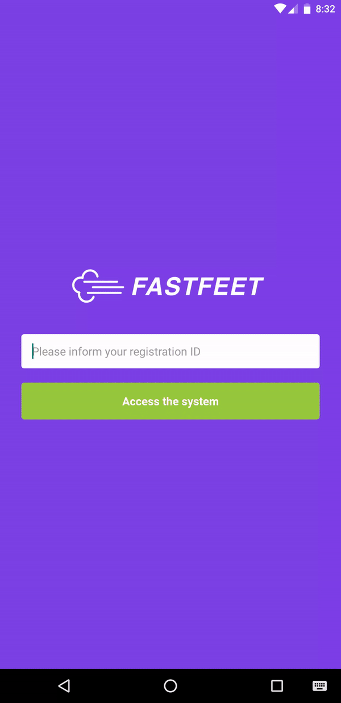

<h1 align="center">
    
</h1>

<h3 align="center">
  FastFeet - Mobile
</h3>
<p align="center">
  A ReactNative application for the delivery man of a imaginary shoe delivery company
</p>

<p align="center">
  
  
  
   
  

  

</p>


:rocket: The Challenge
------------------
This challenge was proposed at a [**Rocketseat**](https://rocketseat.com.br/) GoSack bootcamp! The main objective is creating a 
mobile application for the providers of a imaginary delivery company, in wich they can see their asigned deliveries and alter their status. The back-end NodeJS server can be seen [here](https://github.com/lucascassilha/node-fastfeet), and the front-end ReactJS application can be seen [here](https://github.com/lucascassilha/react-fastfeet).

The challenge GitHub page can be seen [here](https://github.com/Rocketseat/bootcamp-gostack-desafio-10#desafio-10-mobile-do-meetapp).
(Brazilian Portuguese)

#### Changes and Implementations!
In this project a few things were added that weren't in the instructions:

- Added a activity indication on the buttons!
- Some pages have a ScrollView container to adapt to smaller screens!
- Showed the problem description text limit on the submit button (My NodeJS backend has a string limitation of 256 chars)


:pencil2: The project
----------------------

<h3 align="center">
    
</h3>


:wrench: Technologies used
----------------------
In this project the following technologies and libraries were used:

- [**ReactNative**](https://reactnative.dev/?source=post_page-----3c2e6f4b2999----------------------)
- [**Redux**](https://redux.js.org/basics/usage-with-react/)
- [**Redux Persist**](https://github.com/rt2zz/redux-persist)
- [**React Navigation**](https://reactnavigation.org/)
- [**React Native Camera**](https://github.com/react-native-community/react-native-camera)
- [**React Native Vector Icons**](https://github.com/oblador/react-native-vector-icons)
- [**Async Storage**](https://github.com/react-native-community/async-storage)
- [**Styled Components**](https://styled-components.com/)
- [**Axios**](https://github.com/axios/axios)
- [**date-fns**](https://date-fns.org/docs/Getting-Started)
- [**Prop Types**](https://www.npmjs.com/package/prop-types)
- [**Immer**](https://github.com/immerjs/immer)
- [**Reactotron**](https://github.com/infinitered/reactotron)
- [**ESlint**](https://eslint.org/)
- [**Prettier**](https://prettier.io/)

## :information_source: How to use this project
To clone and run this application, you'll need Yarn. Input theese lines in your command line:

```bash
# Clone this repository
$ git clone https://github.com/lucascassilha/react-native-fastfeet

# Go into the repository
$ cd react-native-fastfeet

# Install dependencies
$ yarn

# Build the app with an emulator running
$ yarn react-native run-android OR run-ios

# Run the Metro server
$ yarn start
```

**Observation:** In Genymotion, the axios api localhost url is 10.0.3.2, please change this url to it's appropriate destination if that's the case! If the profile image is not shown within the app, it's probably because the provider avatar API response is in localhost address, and the application baseURL is in another address.

## :scroll: License

This project is under the [MIT license](LICENSE)

:speech_balloon: Reach me
----------

[*In case you want to reach me*](https://www.linkedin.com/in/lcassilha/)


Thank you for taking a look at my project! Made with ♥
